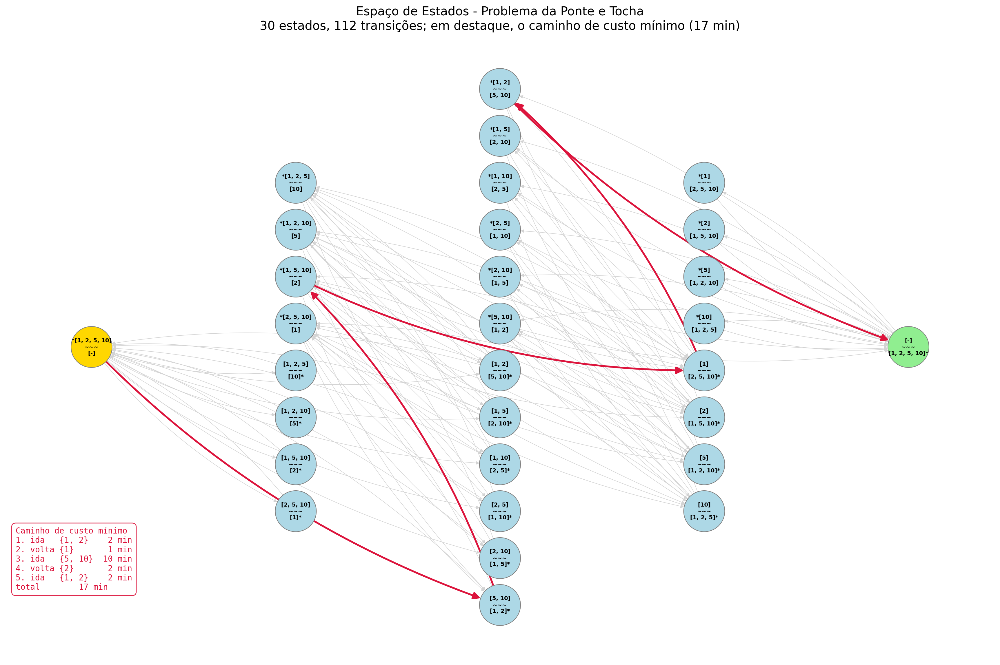

# Bridge and Torch Puzzle

Implementação computacional do problema da Ponte e da Tocha utilizando algoritmos de busca em espaço de estados, desenvolvida para a disciplina de Fundamentos de Inteligência Artificial.

## Autores

**Arthur Fernandes, Bruno Lima e Felipe Augusto**

## Modelagem

- **Estado:** conjunto de pessoas em cada margem e o lado em que está a tocha. Cada pessoa tem identidade própria, separada do seu tempo de travessia (1, 2, 5 e 10 minutos) - duas pessoas igualmente rápidas continuam sendo duas pessoas.
- **Estado inicial:** todas as pessoas e a tocha na margem esquerda. **Objetivo:** todas as pessoas e a tocha na margem direita.
- **Função sucessora:** move 1 ou 2 pessoas do lado onde está a tocha para o outro lado, gerando as arestas do grafo de espaço de estados.
- **Custo da transição:** o tempo da pessoa mais lenta do grupo que atravessa. O custo de um caminho, `g(n)`, é o tempo total acumulado.

Os tempos e a capacidade da ponte são parâmetros (`BridgeProblem(times=..., capacity=...)`), o que permite estudar instâncias maiores sem tocar nos algoritmos.

A busca segue o procedimento geral visto em aula: a **fronteira é um conjunto de caminhos**, e o que distingue cada estratégia é apenas o critério de seleção do próximo caminho a ser expandido.

## Estratégias Implementadas

- **Buscas cegas (sem heurística)**
  - `BreadthFirstSearch` - Busca em Largura (BFS): fronteira em fila FIFO, seleciona o caminho com menos arestas.
  - `DepthFirstSearch` - Busca em Profundidade (DFS): fronteira em pilha LIFO.
  - `LowestCostFirstSearch` - Busca pelo Primeiro Caminho de Custo Mínimo (também chamada de Busca de Custo Uniforme): fronteira em fila de prioridade ordenada por `cost(p)`.
- **Busca informada**
  - `AStarSearch` - Busca A\*: fronteira em fila de prioridade ordenada por `f(p) = cost(p) + h(n)`.

### Heurísticas

Ambas são admissíveis e consistentes, o que é verificado exaustivamente nos testes e por `make heuristics`:

- **`h1`** - tempo da pessoa mais lenta ainda na margem esquerda.
- **`h2`** - limite inferior do emparelhamento das idas somado ao custo mínimo dos retornos obrigatórios. Domina `h1` e expande menos nós.

## Espaço de Estados (Grafo)

Abaixo encontra-se a modelagem visual do problema, representando as ramificações e custos (tempos) de transição desde o estado inicial até à meta. O caminho de custo mínimo aparece destacado em vermelho:



## Como Executar

Este projeto utiliza o `uv` (gerenciador de pacotes e ambientes Python) integrado através de um `Makefile` para facilitar o fluxo de desenvolvimento.

### Pré-requisitos

Certifique-se de ter o [uv](https://github.com/astral-sh/uv) e o `make` instalados na sua máquina.

### Comandos Disponíveis

Na raiz do projeto, utilize os seguintes comandos no terminal:

- **`make setup`**: Cria o ambiente virtual (`.venv`) e instala as dependências exatas definidas no `requirements.txt`.
- **`make test`**: Executa a suíte completa de testes via `pytest` (modelagem, algoritmos, métricas, heurísticas e propriedades do grafo).
- **`make run`**: Executa o comparativo dos algoritmos de busca e grava no `resultados.md` a tabela de métricas e o caminho da solução ótima. Cada algoritmo é executado 1000 vezes para o cálculo do tempo médio; use `make run REPS=100` para alterar esse número.
- **`make transitions`**: Mapeia todo o espaço de estados e grava no `resultados.md` as propriedades do grafo e a lista de adjacências completa, com todas as transições válidas e seus custos.
- **`make heuristics`**: Verifica admissibilidade e consistência das heurísticas em todos os estados e grava a comparação entre elas no `resultados.md`.
- **`make scaling`**: Repete o comparativo para grupos de 4 a 8 pessoas e grava a análise de escalabilidade, onde as diferenças entre os métodos aparecem com clareza.
- **`make report`**: Executa `run`, `transitions`, `heuristics` e `scaling` em sequência, produzindo o relatório completo.
- **`make graph`**: Mapeia o domínio do problema e exporta a visualização do grafo em alta resolução para a imagem `bridge_state_graph.png`.
- **`make clean`**: Limpa diretórios de cache (`__pycache__`, `.pytest_cache`) e destrói o ambiente virtual.

### Linha de comando

O `make run` é um atalho para `src.main`, que aceita parâmetros:

```bash
uv run python -m src.main --algoritmos bfs astar-h2   # escolhe os métodos
uv run python -m src.main --tempos 1 2 5 10 15 --capacidade 3
uv run python -m src.main --repeticoes 200 --saida outro.md
uv run python -m src.main --sem-cache                 # mede sem memoização
```

Os métodos disponíveis são `bfs`, `dfs`, `lcfs`, `astar-h1` e `astar-h2`.

### Desempenho

A função sucessora é determinística, então seu resultado é memoizado e reaproveitado entre repetições e entre algoritmos; o cache é aquecido antes da cronometragem, de modo que todos os métodos sejam medidos nas mesmas condições. Isso responde por uma redução de 62% a 84% no tempo de execução. As buscas por fila de prioridade também mantêm o melhor custo já enfileirado para cada estado, evitando empilhar caminhos dominados.

### Sobre o `resultados.md`

Cada comando é dono de uma seção do arquivo, delimitada por marcadores `<!-- BEGIN:... -->`. Reexecutar qualquer comando **substitui apenas a sua própria seção** e preserva as demais, em qualquer ordem e quantas vezes for necessário - o arquivo nunca acumula conteúdo duplicado.

## Estrutura do Projeto

```
src/
├── models/          # Person, State, Arc (aresta), Path (caminho na fronteira), BridgeProblem
├── algorithms/      # BaseSearch (procedimento geral e métricas), buscas cegas e informada
└── utils/           # espaço de estados, heurísticas, relatórios, escalabilidade e grafo
tests/               # modelagem, algoritmos, heurísticas, grafo, CLI e escalabilidade
```
